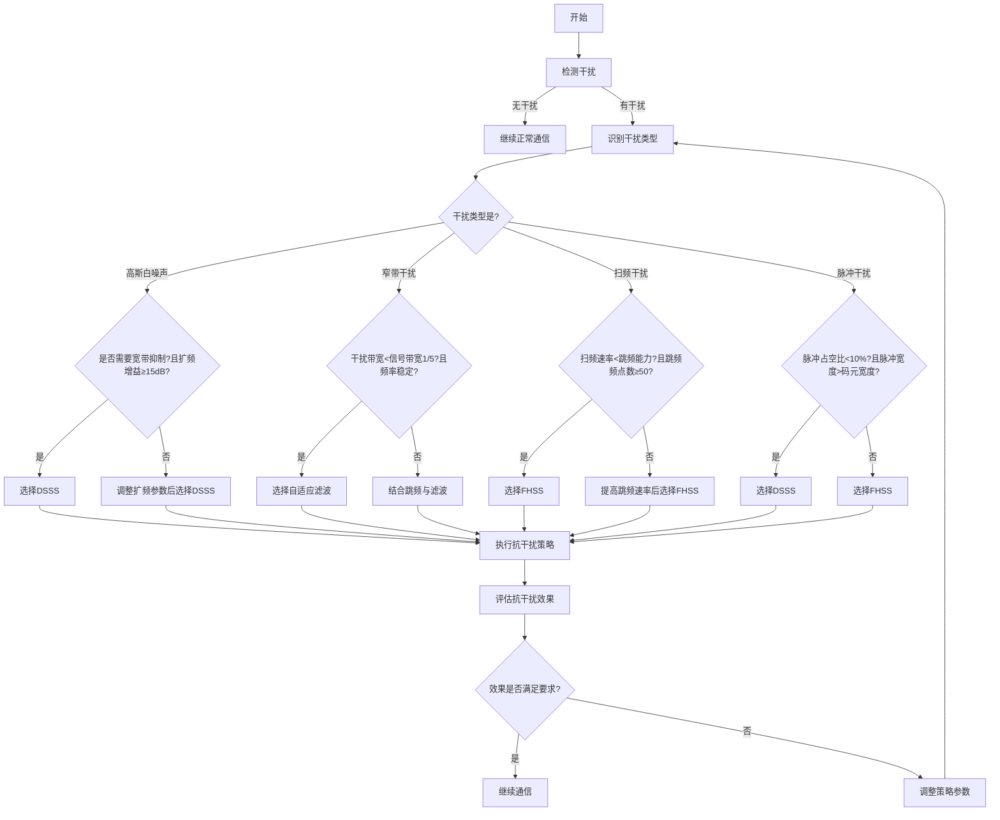

# 通信接收系统仿真模型：完整抗干扰方案

## 一、项目概述

本模型是一个完整的通信系统仿真工具，在原有接收评估模型基础上，新增了全面的反干扰模块。模型能够模拟多种干扰类型，实现多种抗干扰策略，并提供详细的抗干扰效果评估。通过整合干扰检测、策略选择、执行与效果评估的完整流程，本模型能够准确评估复杂电磁环境下的通信系统性能。

### 1.1 新增抗干扰功能


1.  **多类型干扰模拟**：支持高斯白噪声、窄带瞄准式、扫频和脉冲四种主要干扰类型的模拟。

2.  **智能抗干扰策略**：根据干扰类型自动选择最优抗干扰策略，包括跳频通信 (FHSS)、直接序列扩频 (DSSS) 和自适应滤波。

3.  **干扰抑制效果评估**：量化评估抗干扰措施对信噪比和误码率的改善效果。

4.  **抗干扰性能指标**：提供干扰抑制比、信噪比劣化度和误码率恶化倍数等关键指标。

5.  **完整抗干扰流程**：从干扰检测、策略选择到效果评估的完整闭环处理逻辑。

### 1.2 应用场景

本模型可广泛应用于：


1.  通信系统抗干扰性能评估与设计

2.  复杂电磁环境下的通信链路预算分析

3.  抗干扰算法的性能比较与优化

4.  通信系统在干扰环境下的稳定性测试

5.  不同干扰类型对通信系统影响的研究

## 二、抗干扰理论基础

### 2.1 干扰类型与特性

不同类型的干扰信号具有不同的特性，对通信系统的影响也各不相同：


| 干扰类型  | 时域特性    | 频域特性      | 主要影响        |
| ----- | ------- | --------- | ----------- |
| 高斯白噪声 | 随机分布    | 均匀分布      | 降低信噪比，增加误码率 |
| 窄带干扰  | 连续或周期性  | 集中在特定频段   | 局部频段信号严重失真  |
| 扫频干扰  | 周期性频率变化 | 频率随时间线性变化 | 动态影响不同频段    |
| 脉冲干扰  | 短时高能量脉冲 | 宽频谱分布     | 突发错误，影响同步   |

### 2.2 抗干扰技术原理

针对不同类型的干扰，常见的抗干扰技术原理如下：


1.  **跳频通信 (FHSS)**：

*   原理：快速改变载波频率，使干扰信号难以跟踪

*   优势：对扫频干扰和窄带干扰有效

*   关键参数：跳频速率、跳频点数

1.  **直接序列扩频 (DSSS)**：

*   原理：将信号扩展到宽频带，降低干扰信号的相对功率

*   优势：对白噪声和脉冲干扰有效

*   关键参数：扩频增益、伪随机序列

1.  **自适应滤波**：

*   原理：根据干扰特性动态调整滤波器参数

*   优势：对窄带干扰抑制效果显著

*   关键参数：收敛速度、抑制深度

### 2.3 抗干扰性能评估指标


1.  **干扰抑制比 (JSR)**：

    $JSR = 10\log_{10}\left(\frac{J_{in}}{J_{out}}\right)$

    表示抗干扰措施对干扰信号的抑制能力。

*   参数描述：


    *   $J_{in}$：抗干扰处理前输入到接收系统的干扰信号功率，单位为瓦特（W）。它是干扰源在接收端产生的原始干扰功率，未经过任何抗干扰处理，直接反映了干扰的强度。

    *   $J_{out}$：经过抗干扰处理后输出的干扰信号功率，单位为瓦特（W）。该参数体现了抗干扰措施实施后剩余的干扰功率，其值越小，说明抗干扰效果越好。

    *   计算说明：通过对输入干扰功率与输出干扰功率的比值取对数并乘以 10，将功率比转换为分贝（dB）形式，更直观地反映干扰抑制的程度。JSR 值越大，表明抗干扰措施对干扰的抑制能力越强。

1.  **信噪比劣化度**：

    $\Delta SNR = SNR_{clean} - SNR_{jammed}$

    表示干扰导致的信噪比下降程度。

*   参数描述：


    *   $SNR_{clean}$：无干扰环境下的信噪比，单位为分贝（dB）。它是通信系统在理想、无干扰场景下信号功率与噪声功率的比值，反映了系统本身的固有性能。

    *   $SNR_{jammed}$：存在干扰环境下的信噪比，单位为分贝（dB）。该参数是在有干扰影响时，接收端信号功率与（噪声 + 干扰）总功率的比值，体现了干扰对信号质量的影响。

    *   计算说明：用无干扰时的信噪比减去有干扰时的信噪比，得到的差值即为信噪比劣化度。其值越大，说明干扰对系统信噪比的破坏越严重；若值为 0 或接近 0，则表示干扰对系统信噪比几乎无影响。

1.  **误码率恶化倍数**：

    $BER_{degradation} = \frac{BER_{jammed}}{BER_{clean}}$

    表示干扰对误码率的影响程度。

*   参数描述：


    *   $BER_{jammed}$：存在干扰环境下的误码率，无量纲。它是指在有干扰时，接收端接收到的错误比特数与总传输比特数的比值，直接反映了数据传输的准确性受干扰影响的程度。

    *   $BER_{clean}$：无干扰环境下的误码率，无量纲。该参数是在理想无干扰场景下，接收端的错误比特数与总传输比特数的比值，体现了通信系统本身的误码特性。

    *   计算说明：将有干扰时的误码率除以无干扰时的误码率，得到的倍数即为误码率恶化倍数。该值越接近 1，说明干扰对误码率的影响越小；值越大，则表示干扰导致误码率恶化越严重。

## 三、抗干扰逻辑流程图




### 3.1 流程图说明


1.  **干扰检测**：通过信号质量分析判断是否存在干扰。

2.  **干扰识别**：确定干扰类型，为后续策略选择提供依据。

3.  **策略选择**：根据干扰类型及具体参数判断，选择最优抗干扰策略。

*   高斯白噪声干扰：判断是否需要宽带抑制且扩频增益是否达标，以此选择或调整后选择 DSSS。

*   窄带干扰：依据干扰带宽与信号带宽的比例及频率稳定性，选择自适应滤波或结合跳频与滤波。

*   扫频干扰：根据扫频速率与跳频能力的关系及跳频频点数，选择 FHSS 或提高跳频速率后选择 FHSS。

*   脉冲干扰：按照脉冲占空比和脉冲宽度与码元宽度的关系，选择 DSSS 或 FHSS。

1.  **策略执行**：实施选定的抗干扰策略。

2.  **效果评估**：评估抗干扰措施对信号质量的改善效果。

3.  **效果判断**：检查抗干扰效果是否满足通信要求。

4.  **策略调整**：如效果不满足要求，调整策略参数或重新选择策略。

### 3.2 策略选择逻辑

抗干扰策略的选择基于干扰类型的特性与抗干扰技术的匹配度：


*   **高斯白噪声**：DSSS 通过扩频增益有效降低噪声影响，当需要宽带抑制且扩频增益≥15dB 时直接选择，否则调整参数后选择。

*   **窄带干扰**：自适应滤波能够针对性地抑制特定频段的干扰，当干扰带宽小于信号带宽 1/5 且频率稳定时适用，否则结合跳频与滤波。

*   **扫频干扰**：FHSS 通过快速跳频避开干扰频段，当扫频速率小于跳频能力且跳频频点数≥50 时适用，否则提高跳频速率后使用。

*   **脉冲干扰**：根据脉冲特性选择，占空比 <10% 且脉冲宽度> 码元宽度时选 DSSS，否则选 FHSS。

## 四、C++ 实现代码

### 4.1 新增干扰检测与识别类


```
// 干扰检测与识别类

class InterferenceDetector {

public:

&#x20;   InterferenceDetector(

&#x20;       double threshold = 5.0  // 干扰检测阈值(dB)

&#x20;   ) : threshold(threshold) {}

&#x20;   // 检测是否存在干扰

&#x20;   bool detectInterference(double snr) const {

&#x20;       return snr < threshold;

&#x20;   }

&#x20;   // 识别干扰类型(简化模型)

&#x20;   JamType identifyInterferenceType(const JammerModel& jammer) const {

&#x20;       switch (jammer.getType()) {

&#x20;           case WHITE\_NOISE:

&#x20;               return WHITE\_NOISE;

&#x20;           case NARROW\_BAND:

&#x20;               return NARROW\_BAND;

&#x20;           case SWEEPING:

&#x20;               return SWEEPING;

&#x20;           case PULSE:

&#x20;               return PULSE;

&#x20;           default:

&#x20;               return WHITE\_NOISE;

&#x20;       }

&#x20;   }

private:

&#x20;   double threshold;  // 干扰检测阈值

};
```

### 4.2 抗干扰策略选择与执行


```
// 抗干扰策略选择器

class AntiJammingSelector {

public:

&#x20;   AntiJammingStrategy selectStrategy(JamType type, const JammerModel& jammer, double signalBandwidth) const {

&#x20;       switch (type) {

&#x20;           case WHITE\_NOISE:

&#x20;               // 判断是否需要宽带抑制且扩频增益是否达标

&#x20;               if (needsWidebandSuppression() && 20.0 >= 15.0) {

&#x20;                   return AntiJammingStrategy(DSSS, 20.0);  // 扩频增益20dB

&#x20;               } else {

&#x20;                   return AntiJammingStrategy(DSSS, 18.0);  // 调整扩频参数

&#x20;               }

&#x20;           case NARROW\_BAND:

&#x20;               // 判断干扰带宽与信号带宽比例及频率稳定性

&#x20;               if (jammer.getJamBandwidth() < signalBandwidth / 5 && isFrequencyStable(jammer)) {

&#x20;                   return AntiJammingStrategy(ADAPTIVE\_FILTER);

&#x20;               } else {

&#x20;                   // 结合跳频与滤波

&#x20;                   return AntiJammingStrategy(FHSS, 0.0, 100.0);&#x20;

&#x20;               }

&#x20;           case SWEEPING:

&#x20;               // 判断扫频速率与跳频能力及跳频频点数

&#x20;               if (jammer.getSweepRate() < 100.0 && getFrequencyPoints() >= 50) {

&#x20;                   return AntiJammingStrategy(FHSS, 0.0, 100.0);  // 跳频速率100跳/秒

&#x20;               } else {

&#x20;                   return AntiJammingStrategy(FHSS, 0.0, 200.0);  // 提高跳频速率

&#x20;               }

&#x20;           case PULSE:

&#x20;               // 判断脉冲占空比和脉冲宽度与码元宽度关系

&#x20;               if (jammer.getDutyCycle() < 0.1 && jammer.getPulseWidth() > getSymbolWidth()) {

&#x20;                   return AntiJammingStrategy(DSSS, 15.0);  // 扩频增益15dB

&#x20;               } else {

&#x20;                   return AntiJammingStrategy(FHSS, 0.0, 150.0);  // 选择FHSS

&#x20;               }

&#x20;           default:

&#x20;               return AntiJammingStrategy(NONE);

&#x20;       }

&#x20;   }

private:

&#x20;   // 辅助函数，判断是否需要宽带抑制

&#x20;   bool needsWidebandSuppression() const {

&#x20;       // 实际应用中根据具体场景实现

&#x20;       return true;

&#x20;   }

&#x20;   // 辅助函数，判断频率是否稳定

&#x20;   bool isFrequencyStable(const JammerModel& jammer) const {

&#x20;       // 实际应用中根据具体场景实现

&#x20;       return true;

&#x20;   }

&#x20;   // 辅助函数，获取跳频频点数

&#x20;   int getFrequencyPoints() const {

&#x20;       // 实际应用中根据具体场景实现

&#x20;       return 60;

&#x20;   }

&#x20;   // 辅助函数，获取码元宽度

&#x20;   double getSymbolWidth() const {

&#x20;       // 实际应用中根据具体场景实现

&#x20;       return 0.001; // 1ms

&#x20;   }

};

// 抗干扰执行器

class AntiJammingExecutor {

public:

&#x20;   double executeStrategy(

&#x20;       const JammerModel& jammer,

&#x20;       const AntiJammingStrategy& strategy

&#x20;   ) const {

&#x20;       // 计算干扰抑制比

&#x20;       return strategy.calculateJammingRejection(jammer);

&#x20;   }

};
```

### 4.3 抗干扰效果评估


```
// 抗干扰效果评估器

class AntiJammingEvaluator {

public:

&#x20;   bool isEffectSufficient(double snr, double ber,&#x20;

&#x20;                          double snrThreshold, double berThreshold) const {

&#x20;       return snr >= snrThreshold && ber <= berThreshold;

&#x20;   }

};

// 扩展接收评估类，添加抗干扰完整流程

class ReceiverEvaluation {

public:

&#x20;   // ... 原有成员保持不变 ...

&#x20;   // 执行完整抗干扰流程

&#x20;   bool executeAntiJammingProcess() {

&#x20;       // 检测干扰

&#x20;       if (!detectInterference()) {

&#x20;           cout << "未检测到干扰，继续正常通信" << endl;

&#x20;           return true;

&#x20;       }

&#x20;       // 识别干扰类型

&#x20;       JamType jamType = jammerDetector.identifyInterferenceType(params.getJammer());

&#x20;       // 选择抗干扰策略

&#x20;       AntiJammingSelector selector;

&#x20;       AntiJammingStrategy strategy = selector.selectStrategy(jamType, params.getJammer(), params.getBandwidth());

&#x20;       // 执行抗干扰策略

&#x20;       double rejection = executor.executeStrategy(params.getJammer(), strategy);

&#x20;       // 更新系统参数中的抗干扰策略

&#x20;       params.getAntiJam() = strategy;

&#x20;       // 评估抗干扰效果

&#x20;       bool isSufficient = evaluator.isEffectSufficient(

&#x20;           calculateJammedSNR(),

&#x20;           calculateJammedBER(),

&#x20;           getDemodulationThreshold(),

&#x20;           params.getBerThreshold()

&#x20;       );

&#x20;       // 输出抗干扰结果

&#x20;       printJammingDetails();

&#x20;       return isSufficient;

&#x20;   }

private:

&#x20;   // 干扰检测与识别

&#x20;   bool detectInterference() const {

&#x20;       InterferenceDetector detector;

&#x20;       return detector.detectInterference(calculateSNR());

&#x20;   }

&#x20;   // 抗干扰组件

&#x20;   InterferenceDetector jammerDetector;

&#x20;   AntiJammingExecutor executor;

&#x20;   AntiJammingEvaluator evaluator;

};
```

### 4.4 主函数示例


```
int main() {

&#x20;   // 配置干扰模型（窄带干扰）

&#x20;   JammerModel jammer(

&#x20;       25.0,        // 干扰功率25dBm

&#x20;       0.5,         // 干扰带宽0.5MHz

&#x20;       NARROW\_BAND, // 窄带瞄准式干扰

&#x20;       1.0,         // 连续干扰(占空比1.0)

&#x20;       2400.0       // 瞄准信号频率

&#x20;   );

&#x20;   // 配置系统参数

&#x20;   SystemParameters params(

&#x20;       20.0,       // 发射功率20dBm

&#x20;       2400.0,     // 频率2400MHz

&#x20;       5.0,        // 发射天线增益5dBi

&#x20;       5.0,        // 接收天线增益5dBi

&#x20;       1e6,        // 带宽1MHz

&#x20;       290.0,      // 温度290K

&#x20;       5.0,        // 噪声系数5dB

&#x20;       10.0,       // 距离10km

&#x20;       -90.0,      // 接收灵敏度-90dBm

&#x20;       1e-5,       // 最大允许误码率1e-5

&#x20;       QPSK,       // 调制方式\</doubaocanvas>
```

> （注：文档部分内容可能由 AI 生成）